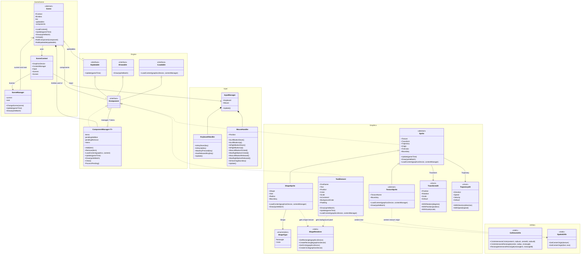

# Core2D UML
Generated with copilot, I am lazy

```mermaid
classDiagram
direction TB

namespace Engine {
    class IUpdatable {
        <<interface>>
        +Update(gameTime)
    }
    class IDrawable {
        <<interface>>
        +Draw(spriteBatch)
    }
    class ILoadable {
        <<interface>>
        +LoadContent(graphicsDevice, contentManager)
    }
    class IComponent {
        <<interface>>
    }
    class ComponentManager~T~ {
        -items
        -pendingAddition
        -pendingRemoval
        +Items
        +Add(item)
        +Remove(item)
        +LoadContent(graphics, content)
        +Update(gameTime)
        +Draw(spriteBatch)
        +Clear()
        -ProcessPending()
    }
}

namespace GameScene {
    class Scene {
        <<abstract>>
        #Context
        #Entities
        #UI
        -updatables
        -components
        +LoadContent()
        +Update(gameTime)
        +Draw(spriteBatch)
        +Unload()
        #AddComponent(component)
        #AddUpdatable(updatable)
    }
    class SceneContext {
        +GraphicsDevice
        +ContentManager
        +Input
        +Scenes
        +Screen
    }
    class SceneManager {
        -current
        -next
        +ChangeScene(scene)
        +Update(gameTime)
        +Draw(spriteBatch)
    }
}

namespace Graphics {
    class Sprite {
        <<abstract>>
        +Texture
        +Transform
        +Trajectory
        +Origin
        +TintColor
        +Boundary
        +Update(gameTime)
        +Draw(spriteBatch)
        +LoadContent(graphicsDevice, contentManager)
    }
    class ShapeSprite {
        +Shape
        +Size
        +Radius
        +Boundary
        +LoadContent(graphicsDevice, contentManager)
        +Draw(spriteBatch)
    }
    class TextureSprite {
        <<abstract>>
        +TextureName
        +Boundary
        +LoadContent(graphicsDevice, contentManager)
        +Draw(spriteBatch)
    }
    class TextElement {
        +FontName
        +Text
        +Position
        +Color
        +Scale
        +IsCentered
        +BackgroundColor
        +Padding
        +Draw(spriteBatch)
        +Update(gameTime)
        +LoadContent(graphicsDevice, contentManager)
    }
    class ShapeType {
        <<enumeration>>
        Rectangle
        Circle
    }
    class Transform2D {
        <<struct>>
        +Position
        +Rotation
        +Scale
        +WithRotation(degrees)
        +WithPosition(position)
        +WithScale(scale)
        +Default
    }
    class Trajectory2D {
        <<struct>>
        +Direction
        +Speed
        +Velocity
        +WithDirection(direction)
        +WithSpeed(speed)
        +Default
    }
    class ShapeRenderer {
        <<static>>
        +GetRectangle(graphicsDevice)
        +CreateRectangle(graphicsDevice)
        +GetCircle(graphicsDevice)
        +CreateCircle(graphicsDevice)
    }
}

namespace Utilities {
    class CollisionUtils {
        <<static>>
        +CircleIntersectsCircle(centerA, radiusA, centerB, radiusB)
        +CircleIntersectsRectangle(center, radius, rectangle)
        +RectangleIntersectsRectangle(rectangleA, rectangleB)
    }
    class SpatialUtils {
        <<static>>
        +GetCenterOrigin(texture)
        +GetCenterOrigin(font, text)
    }
}

namespace Input {
    class InputManager {
        +Keyboard
        +Mouse
        +Update()
    }
    class KeyboardHandler {
        +IsKeyDown(key)
        +IsKeyUp(key)
        +WasKeyPressed(key)
        +HasReleasedKey(key)
        +Update()
    }
    class MouseHandler {
        +Position
        +IsLeftButtonDown()
        +IsLeftButtonUp()
        +IsRightButtonDown()
        +IsRightButtonUp()
        +WasLeftButtonClicked()
        +WasRightButtonClicked()
        +WasLeftButtonReleased()
        +WasRightButtonReleased()
        +IsHovering(boundary)
        +Update()
    }
}

IUpdatable <|-- IComponent
IDrawable <|-- IComponent
ILoadable <|-- IComponent
IComponent <|.. ComponentManager~T~
IComponent <|.. Sprite
IComponent <|.. TextElement

Sprite <|-- ShapeSprite
Sprite <|-- TextureSprite

ComponentManager~T~ o-- "0..*" IComponent : manages T items
Scene --> SceneContext : uses
Scene *-- ComponentManager~T~ : Entities and UI
Scene o-- "0..*" IComponent : components
Scene o-- "0..*" IUpdatable : updatables
SceneManager --> "0..2" Scene : current and next
SceneContext --> InputManager : Input
SceneContext --> SceneManager : Scenes

Sprite --> Transform2D : Transform
Sprite --> Trajectory2D : Trajectory
ShapeSprite --> ShapeType : Shape
ShapeSprite ..> ShapeRenderer : gets shape texture
TextElement ..> ShapeRenderer : gets background pixel
TextElement ..> SpatialUtils : centers text
TextureSprite ..> SpatialUtils : centers texture origin

InputManager *-- KeyboardHandler
InputManager *-- MouseHandler
```