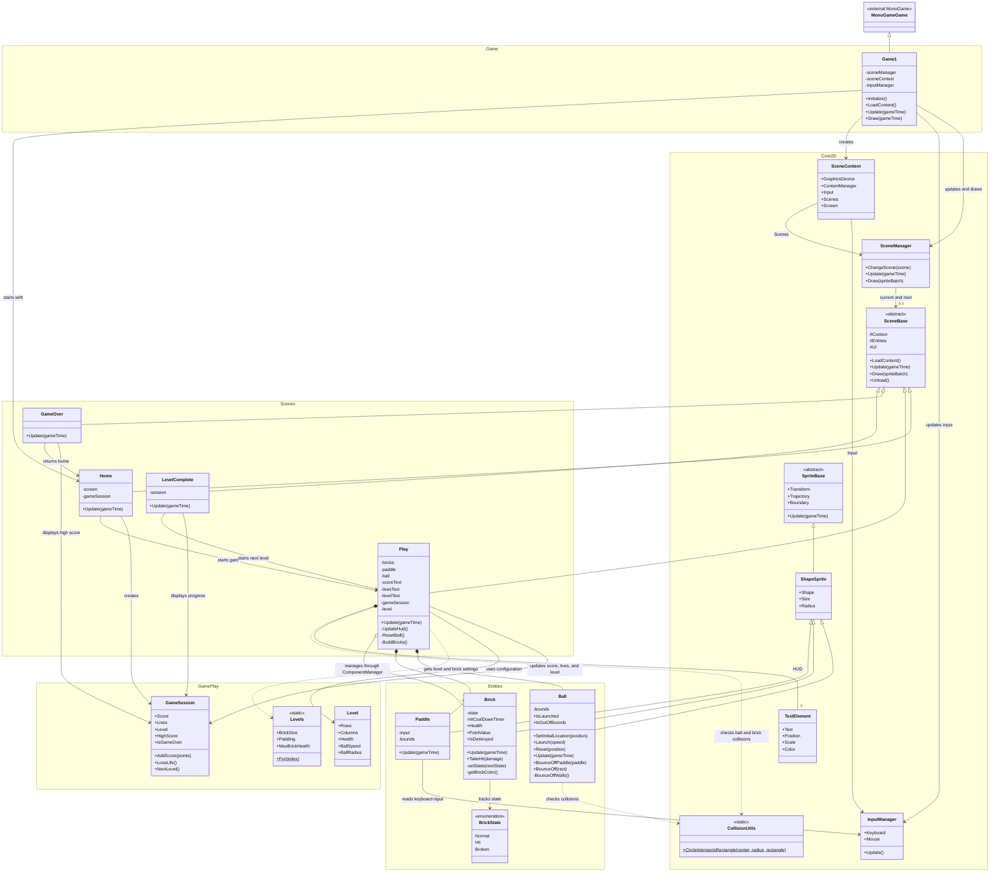

# brick_incorporated UML
generated with copilot, I am lazy

```mermaid
classDiagram
direction TB

namespace Game {
    class Game1 {
        -sceneManager
        -sceneContext
        -inputManager
        +Initialize()
        +LoadContent()
        +Update(gameTime)
        +Draw(gameTime)
    }
}

namespace Entities {
    class Ball {
        -bounds
        +IsLaunched
        +IsOutOfBounds
        +SetInitialLocation(position)
        +Launch(speed)
        +Reset(position)
        +Update(gameTime)
        +BounceOffPaddle(paddle)
        +BounceOff(rect)
        -BounceOffWalls()
    }

    class Brick {
        -state
        -hitCoolDownTimer
        +Health
        +PointValue
        +IsDestroyed
        +Update(gameTime)
        +TakeHit(damage)
        -setState(nextState)
        -getBrickColor()
    }

    class BrickState {
        <<enumeration>>
        Normal
        Hit
        Broken
    }

    class Paddle {
        -input
        -bounds
        +Update(gameTime)
    }
}

namespace GamePlay {
    class GameSession {
        +Score
        +Lives
        +Level
        +HighScore
        +IsGameOver
        +AddScore(points)
        +LoseLife()
        +NextLevel()
    }

    class Level {
        +Rows
        +Columns
        +Health
        +BallSpeed
        +BallRadius
    }

    class Levels {
        <<static>>
        +BrickSize
        +Padding
        +MaxBrickHealth
        +For(index)$
    }
}

namespace Scenes {
    class Home {
        -screen
        -gameSession
        +Update(gameTime)
    }

    class Play {
        -bricks
        -paddle
        -ball
        -scoreText
        -livesText
        -levelText
        -gameSession
        -level
        +Update(gameTime)
        -UpdateHud()
        -ResetBall()
        -BuildBricks()
    }

    class GameOver {
        +Update(gameTime)
    }

    class LevelComplete {
        -session
        +Update(gameTime)
    }
}

namespace Core2D {
    class SceneBase {
        <<abstract>>
        #Context
        #Entities
        #UI
        +LoadContent()
        +Update(gameTime)
        +Draw(spriteBatch)
        +Unload()
    }

    class SceneContext {
        +GraphicsDevice
        +ContentManager
        +Input
        +Scenes
        +Screen
    }

    class SceneManager {
        +ChangeScene(scene)
        +Update(gameTime)
        +Draw(spriteBatch)
    }

    class InputManager {
        +Keyboard
        +Mouse
        +Update()
    }

    class SpriteBase {
        <<abstract>>
        +Transform
        +Trajectory
        +Boundary
        +Update(gameTime)
    }

    class ShapeSprite {
        +Shape
        +Size
        +Radius
    }

    class TextElement {
        +Text
        +Position
        +Scale
        +Color
    }

    class CollisionUtils {
        <<static>>
        +CircleIntersectsRectangle(center, radius, rectangle)$
    }
}

class MonoGameGame {
    <<external MonoGame>>
}

MonoGameGame <|-- Game1

SceneBase <|-- Home
SceneBase <|-- Play
SceneBase <|-- GameOver
SceneBase <|-- LevelComplete

SpriteBase <|-- ShapeSprite
ShapeSprite <|-- Ball
ShapeSprite <|-- Brick
ShapeSprite <|-- Paddle

Game1 --> SceneManager : updates and draws
Game1 --> InputManager : updates input
Game1 --> SceneContext : creates
Game1 --> Home : starts with

SceneContext --> InputManager : Input
SceneContext --> SceneManager : Scenes
SceneManager --> "0..2" SceneBase : current and next

Home --> GameSession : creates
Home --> Play : starts game
GameOver --> GameSession : displays high score
GameOver --> Home : returns home
LevelComplete --> GameSession : displays progress
LevelComplete --> Play : starts next level

Play --> GameSession : updates score, lives, and level
Play --> Level : uses configuration
Play ..> Levels : gets level and brick settings
Play *-- Ball
Play *-- Paddle
Play o-- "0..*" Brick : manages through ComponentManager
Play *-- "3" TextElement : HUD

Paddle --> InputManager : reads keyboard input
Brick --> BrickState : tracks state
Ball ..> CollisionUtils : checks collisions
Play ..> CollisionUtils : checks ball and brick collisions
```